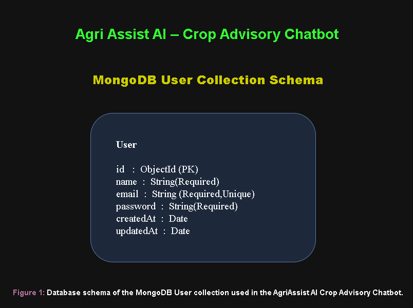

# 🌱 Agro AI – AI-Powered Crop Advisory Platform

## Overview

Agro AI is a full-stack AI-powered Crop Advisory Platform developed as part of the **TBI-GEU Summer Internship Program 2026**. The platform helps farmers make informed agricultural decisions through Artificial Intelligence, secure authentication, crop management, and modern web technologies.

The application consists of a **Next.js frontend**, **Node.js/Express backend**, **MongoDB Atlas** database, **JWT Authentication**, **Google OAuth Login**, and **Google Gemini AI** integration.

Users can securely register, log in, manage crop information, access protected pages, and receive AI-powered farming recommendations in real time.

### Key Highlights

- 🌱 AI Crop Advisory using Google Gemini AI
- 🌾 Crop Information Management (CRUD)
- 📊 Dashboard with Real-time Statistics
- 🔐 JWT Authentication & Google OAuth
- 🐛 Pest Detection Module
- 💹 Market Price Module
- 📱 Fully Responsive User Interface
- 🌙 Dark Mode Support

---

# Project Links

## GitHub Repository

https://github.com/harshavennapu/AI-Powered-Crop-Advisory-Chatbot-Prototype-

## Figma Wireframes

https://www.figma.com/design/WqO78g3MdiHz4XJCQVjYgy/Week-3-Wireframes

---

# Documentation

- README.md
- PROMPTS.md (Prompt Engineering Log)
- Postman Collection
- Database Schema
- Weekly Deliverables
- Frontend Completion Report

---

# Features

## 🤖 AI Features

- AI-powered Crop Advisory using Google Gemini AI
- Intelligent Farming Recommendations
- Smart Prompt Processing
- Real-time AI Response Generation
- Loading State while generating responses
- User-friendly Error Handling
- Agriculture-focused AI Assistance

---

## 🌾 Crop Management Features

- Add Crop
- View Crop Details
- Update Crop Information
- Delete Crop
- Crop Details Modal
- Real-time CRUD Operations
- Form Validation
- Success & Error Notifications
- Crop Database Management

---

## 📊 Dashboard Features

- Dashboard Statistics
- Total Users Counter
- Total Crops Counter
- Protected Dashboard
- Real-time API Integration

---

## 👤 Authentication Features

- User Registration
- User Login
- Google OAuth Login
- JWT Authentication
- Protected Routes
- Logout Functionality
- Secure Password Hashing (bcrypt)
- Request Validation
- API Rate Limiting

---

## 🌿 Agricultural Features

- AI Crop Advisory
- Crop Information Management
- Pest Detection
- Market Prices
- Smart Farming Dashboard
- Agriculture Recommendations

---

## 💻 Frontend Features

- Responsive Design
- Dashboard
- Crop CRUD Interface
- Modern UI
- Mobile Friendly
- Dark Mode Support
- Component-based Architecture
- AI Prompt Input
- AI Response Display
- Loading Spinner
- Error Messages
- Responsive Navigation
- Reusable Components
- Empty State UI
- Form Validation

---

# Tech Stack

## Frontend

- Next.js
- React.js
- Tailwind CSS
- JavaScript (ES6+)

---

## Backend

- Node.js
- Express.js
- REST API
- Google Gemini AI API

---

## Database

- MongoDB Atlas
- Mongoose ODM

---

## Authentication

- JWT
- Google OAuth 2.0
- Passport.js
- bcryptjs

---

## Validation & Security

- express-validator
- express-rate-limit
- CORS
- Environment Variables
- Protected Routes

---

## Development Tools

- Git
- GitHub
- Visual Studio Code
- Postman
- Thunder Client
- Google AI Studio
- Google Cloud Console
- Chrome DevTools

---

# Project Structure

```text
AI-Powered-Crop-Advisory-Chatbot-Prototype-

│
├── front-end/
│
│   ├── app/
│   │   ├── about/
│   │   ├── ai_features/
│   │   ├── dashboard/
│   │   ├── detail_listview/
│   │   ├── login/
│   │   ├── market_prices/
│   │   ├── pest_detection/
│   │   ├── profile/
│   │   ├── showcase/
│   │   └── signup/
│   │
│   ├── components/
│   │   ├── ui/
│   │   ├── Hero.jsx
│   │   ├── Navbar.jsx
│   │   └── Footer.jsx
│   │
│   ├── public/
│   ├── package.json
│   └── ...
│
├── back-end/
│
│   ├── config/
│   ├── controllers/
│   │   ├── aiController.js
│   │   ├── cropController.js
│   │   ├── dashboardController.js
│   │   ├── marketController.js
│   │   └── userController.js
│   │
│   ├── middleware/
│   ├── models/
│   │   ├── Crop.js
│   │   └── User.js
│   │
│   ├── routes/
│   │   ├── aiRoutes.js
│   │   ├── cropRoutes.js
│   │   ├── dashboardRoutes.js
│   │   ├── marketRoutes.js
│   │   ├── pestRoutes.js
│   │   └── userRoutes.js
│   │
│   ├── server.js
│   ├── package.json
│   └── .env
│
├── Docs/
│
├── postman/
│
├── PROMPTS.md
│
└── README.md
```

---

# Database

This project uses **MongoDB Atlas** with **Mongoose ODM** for secure and scalable data storage.

---

## User Model

- Name
- Email
- Password (Encrypted)
- CreatedAt
- UpdatedAt

---

## Crop Model

- Crop Name
- Season
- Soil Type
- Fertilizer
- Water Requirement
- Expected Yield
- CreatedAt
- UpdatedAt

---

## Database Schema



---

# Frontend Routes

| Route            | Description                 |
| ---------------- | --------------------------- |
| /                | Home Page                   |
| /about           | About Page                  |
| /login           | User Login                  |
| /signup          | User Registration           |
| /dashboard       | Protected Dashboard         |
| /ai_features     | AI Crop Advisory            |
| /detail_listview | Crop Information Management |
| /market_prices   | Market Price Information    |
| /pest_detection  | Pest Detection              |
| /profile         | User Profile                |
| /showcase        | UI Components Showcase      |

---

# Backend REST APIs

## Authentication APIs

| Method | Endpoint                  | Description           |
| ------ | ------------------------- | --------------------- |
| POST   | /api/auth/register        | Register User         |
| POST   | /api/auth/login           | Login User            |
| GET    | /api/auth/google          | Google OAuth Login    |
| GET    | /api/auth/google/callback | Google OAuth Callback |

---

## User APIs

| Method | Endpoint          | Description    |
| ------ | ----------------- | -------------- |
| GET    | /api/users        | Get All Users  |
| GET    | /api/users/:id    | Get User By ID |
| PUT    | /api/users/:id    | Update User    |
| DELETE | /api/users/:id    | Delete User    |
| GET    | /api/users/search | Search Users   |

---

## Crop APIs

| Method | Endpoint       | Description   |
| ------ | -------------- | ------------- |
| GET    | /api/crops     | Get All Crops |
| POST   | /api/crops     | Create Crop   |
| PUT    | /api/crops/:id | Update Crop   |
| DELETE | /api/crops/:id | Delete Crop   |

---

## Dashboard APIs

| Method | Endpoint       | Description          |
| ------ | -------------- | -------------------- |
| GET    | /api/dashboard | Dashboard Statistics |

---

## AI APIs

| Method | Endpoint         | Description               |
| ------ | ---------------- | ------------------------- |
| POST   | /api/ai/generate | Generate AI Crop Advisory |

---

## Market APIs

| Method | Endpoint    | Description       |
| ------ | ----------- | ----------------- |
| GET    | /api/market | Get Market Prices |

---

## Pest Detection APIs

| Method | Endpoint  | Description                |
| ------ | --------- | -------------------------- |
| GET    | /api/pest | Pest Detection Information |

---

# Authentication Flow

1. User registers using Email and Password.
2. Password is securely hashed using **bcrypt** before storing in MongoDB.
3. User logs in using valid credentials.
4. The server verifies the credentials.
5. A **JWT Token** is generated.
6. The token is stored in Local Storage.
7. Protected routes verify the token before allowing access.
8. Users can also authenticate using **Google OAuth**.
9. Logout removes the stored token and redirects the user to the Login page.

---

# Dashboard Workflow

1. User logs in successfully.
2. Frontend requests dashboard statistics.
3. Backend fetches data from MongoDB.
4. Dashboard displays:

- Total Users
- Total Crops
- Dashboard Cards

5. Statistics update automatically whenever data changes.

---

# AI Feature Workflow

1. User opens the **AI Features** page.
2. User enters an agriculture-related question.
3. Frontend sends a **POST** request to:

```text
/api/ai/generate
```

4. Backend validates the request.
5. The backend securely communicates with **Google Gemini AI**.
6. Gemini generates an intelligent farming recommendation.
7. Backend sends the AI response.
8. Frontend displays:

- Loading State
- AI Recommendation
- Error Messages (if any)

---

# Crop CRUD Workflow

## Create Crop

User fills the crop form

↓

POST `/api/crops`

↓

Crop stored in MongoDB

↓

Crop cards refresh automatically

---

## Read Crops

GET `/api/crops`

↓

Retrieve all crop records

↓

Display crop cards

---

## Update Crop

Click **Edit**

↓

Modify crop details

↓

PUT `/api/crops/:id`

↓

Database updated

↓

UI refreshed automatically

---

## Delete Crop

Click **Delete**

↓

Confirmation dialog

↓

DELETE `/api/crops/:id`

↓

Crop removed

↓

Cards refresh automatically

---

# Application Workflow

User Login

↓

Dashboard

↓

Select Feature

↓

AI Crop Advisory

or

Crop Management

or

Market Prices

or

Pest Detection

↓

Backend API

↓

MongoDB / Gemini AI

↓

Frontend Response

---

# Database

The application uses **MongoDB Atlas** with **Mongoose ODM** for storing user accounts, crop records, market prices, and dashboard data.

## Collections

### Users

- Name
- Email
- Password (Encrypted)
- Created At
- Updated At

### Crops

- Crop Name
- Season
- Soil Type
- Fertilizer
- Water Requirement
- Expected Yield

### Dashboard

- User Statistics
- Crop Statistics
- Activity Summary

### Market Prices

- Crop Name
- Market
- Price
- Last Updated

---

## Database Schema


# Frontend Routes

| Route            | Description            |
| ---------------- | ---------------------- |
| /                | Home Page              |
| /about           | About Project          |
| /login           | User Login             |
| /signup          | User Registration      |
| /dashboard       | Protected Dashboard    |
| /detail_listview | Crop Management (CRUD) |
| /market_prices   | Market Price Dashboard |
| /ai_features     | AI Crop Advisory       |
| /pest_detection  | Pest Detection         |
| /profile         | User Profile           |
| /showcase        | UI Component Showcase  |

# Backend REST APIs

## Authentication

| Method | Endpoint                  | Description           |
| ------ | ------------------------- | --------------------- |
| POST   | /api/auth/register        | Register User         |
| POST   | /api/auth/login           | Login User            |
| GET    | /api/auth/google          | Google OAuth Login    |
| GET    | /api/auth/google/callback | Google OAuth Callback |

---

## Dashboard APIs

| Method | Endpoint             | Description          |
| ------ | -------------------- | -------------------- |
| GET    | /api/dashboard/stats | Dashboard Statistics |

---

## Crop APIs

| Method | Endpoint       | Description   |
| ------ | -------------- | ------------- |
| GET    | /api/crops     | Get All Crops |
| POST   | /api/crops     | Add Crop      |
| PUT    | /api/crops/:id | Update Crop   |
| DELETE | /api/crops/:id | Delete Crop   |

---

## Market APIs

| Method | Endpoint    | Description       |
| ------ | ----------- | ----------------- |
| GET    | /api/market | Get Market Prices |

---

## AI APIs

| Method | Endpoint         | Description             |
| ------ | ---------------- | ----------------------- |
| POST   | /api/ai/generate | Generate AI Crop Advice |

---

## User APIs

| Method | Endpoint       | Description |
| ------ | -------------- | ----------- |
| GET    | /api/users     | Get Users   |
| GET    | /api/users/:id | Get User    |
| PUT    | /api/users/:id | Update User |
| DELETE | /api/users/:id | Delete User |

# Security Features

- JWT Authentication
- Google OAuth 2.0
- Password Hashing using bcrypt
- Protected Routes
- Express Validator
- Express Rate Limiting
- CORS Protection
- Environment Variables
- Secure Gemini API Key Storage
- Global Error Handling
- Input Validation

---

# Installation

## Clone Repository

```bash
git clone https://github.com/harshavennapu/AI-Powered-Crop-Advisory-Chatbot-Prototype-.git
```

---

## Frontend Setup

```bash
cd front-end
npm install
npm run dev
```

Frontend runs on

```
http://localhost:3000
```

---

## Backend Setup

```bash
cd back-end
npm install
npm run dev
```

Backend runs on

```
https://ai-powered-crop-advisory-chatbot.onrender.com
```

---

# Environment Variables

Create a `.env` file inside the **back-end** folder.

```env
PORT=5000

MONGODB_URI=your_mongodb_connection_string

JWT_SECRET=your_secret_key

GOOGLE_CLIENT_ID=your_google_client_id

GOOGLE_CLIENT_SECRET=your_google_client_secret

GEMINI_API_KEY=your_gemini_api_key
```

> Never commit your `.env` file to GitHub.

---

# API Testing

The backend APIs were tested using:

- Postman
- Browser Network Tab
- Thunder Client

## Authentication

- Register User
- Login User
- Google OAuth Login

## Dashboard

- Dashboard Statistics

## Crop APIs

- Create Crop
- Read Crop
- Update Crop
- Delete Crop

## AI APIs

- Generate Crop Advisory

## Verification

- HTTP Status Codes
- Protected Routes
- JWT Authentication
- Browser Network Requests (200 OK)

---

# Error Handling

The application includes

- Global Error Handler
- Loading States
- Empty States
- Validation Errors
- API Error Responses
- Invalid Route Handling
- Friendly Error Messages

---

# Prompt Engineering

The project contains a dedicated

```
PROMPTS.md
```

which documents

- Prompt Variations
- Sample Inputs
- Sample Outputs
- Best Prompt Selection
- Prompt Engineering Observations

---

# Week 7 Deliverables ✅

### AI Feature Integration

- Google Gemini AI Integration
- Prompt Input UI
- AI Loading State
- AI Response Display
- Error Handling
- Secure API Key Storage

Documentation

```
Docs/W7_AIFeatureDemo_TBI-26100998.pdf
```

---

# Week 8 Deliverables ✅

## Deliverable 1 — Fully Connected Frontend

Completed

- Connected Dashboard with Backend API
- Protected Dashboard using JWT Authentication
- Complete Crop CRUD Operations
- AI Feature connected to Backend
- Responsive UI (375px, 768px, 1440px)
- Loading States
- Empty States
- Error Handling
- Zero Mock Data
- Real API Integration

---

## Deliverable 2 — Frontend Completion PDF

Completed

Documentation

```
Docs/W8_FrontendCompletion_TBI-26100998.pdf
```

Includes

- Authenticated Dashboard
- Create Crop
- Update Crop
- Delete Crop
- AI Feature
- Responsive Views
- Empty State
- Network Verification

---

## Deliverable 3 — Network Verification

Completed

Verified successful API requests

- Dashboard API
- Crop API
- AI API

Status

```
200 OK
```

---

# Current Status

## Frontend

- Responsive Home Page
- Responsive Navigation
- Dashboard
- Authentication
- Crop CRUD
- AI Feature
- Profile Page
- Market Prices
- Pest Detection
- Component Showcase
- Dark Mode
- Empty States
- Loading States

---

## Backend

- REST APIs
- JWT Authentication
- Google OAuth
- MongoDB Atlas
- Crop CRUD APIs
- Dashboard APIs
- AI APIs
- Validation
- Error Handling

---

## Database

- MongoDB Atlas
- Mongoose ODM
- Users Collection
- Crops Collection

---

## Documentation

- README
- PROMPTS
- Postman Collection
- Database Schema
- Week 2 PDF
- Week 3 PDF
- Week 4 PDF
- Week 5 PDF
- Week 6 PDF
- Week 7 PDF
- Week 8 PDF

---

# Future Enhancements

- Weather API Integration
- Image-based Disease Detection
- Voice-enabled AI Assistant
- Farmer Profiles
- Chat History
- Email Verification
- Forgot Password
- Refresh Tokens
- Role-Based Access Control
- Multi-language Support
- Mobile Application

---

# Screenshots

Project documentation is available in the **Docs** folder.

- W2 Frontend Screenshots
- W3 Responsive UI
- W4 Frontend-Backend Connection
- W5 CRUD Verification
- W6 Authentication Flow
- W7 AI Feature Demo
- W8 Frontend Completion

---

# Contributing

Contributions are welcome.

1. Fork the repository.
2. Create a new branch.
3. Commit your changes.
4. Push the branch.
5. Open a Pull Request.

---

# Author

## Vennapu Sree Sai Chandra Harsha

M.Tech – Artificial Intelligence & Machine Learning

TBI-GEU Summer Internship Program 2026

GitHub

https://github.com/harshavennapu

---

# Acknowledgements

- Technology Business Incubator (TBI-GEU)
- Google Gemini AI
- MongoDB Atlas
- Next.js
- React
- Express.js
- Node.js
- Tailwind CSS

---

# License

This project was developed as part of the **TBI-GEU Summer Internship Program 2026** for educational and learning purposes.

---

# ⭐ Project Status

✅ Week 1 — Project Setup

✅ Week 2 — Frontend Development

✅ Week 3 — Responsive UI

✅ Week 4 — Frontend & Backend Integration

✅ Week 5 — MongoDB CRUD Operations

✅ Week 6 — JWT Authentication & Google OAuth

✅ Week 7 — AI Crop Advisory using Google Gemini

✅ Week 8 — Frontend Completion, Dashboard Integration & Responsive CRUD

---

If you found this project useful, consider giving it a ⭐ on GitHub.
