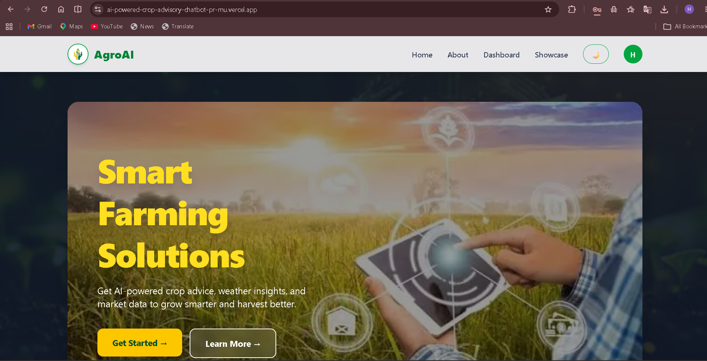
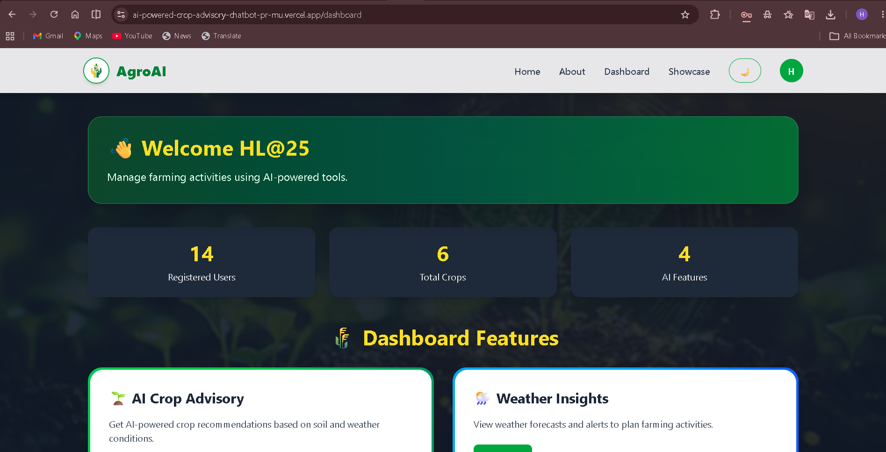
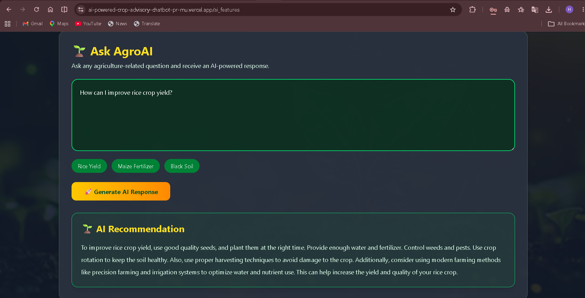
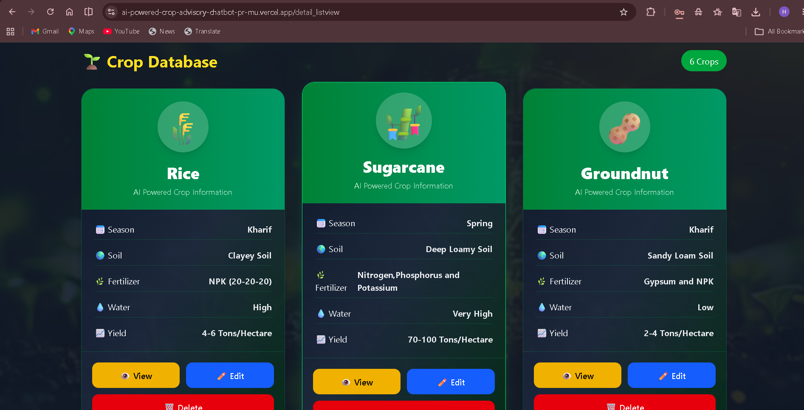
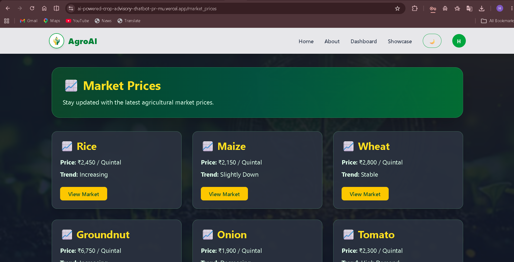
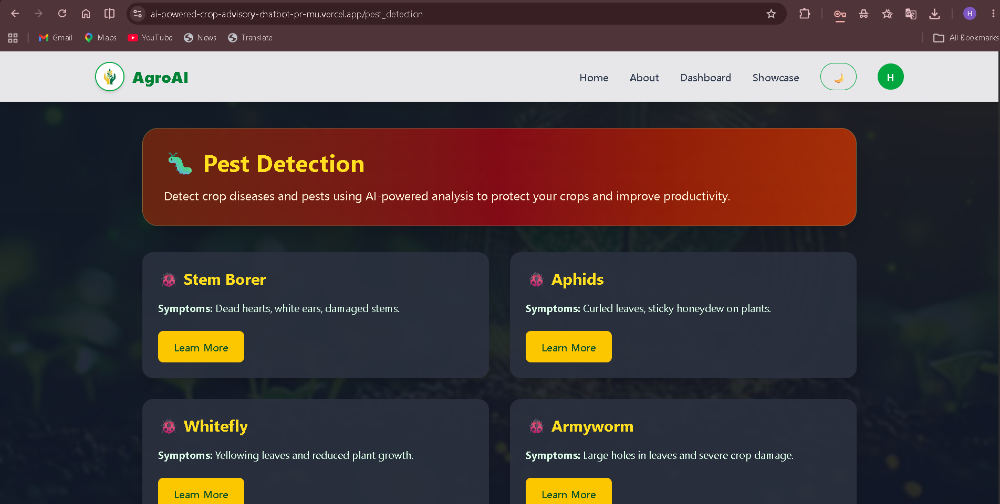
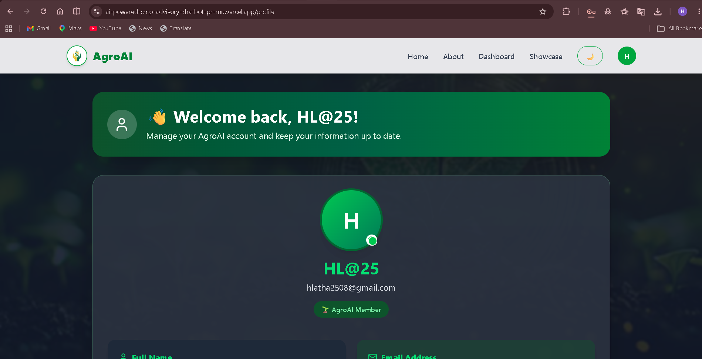

# 🌱 Agro AI – AI-Powered Crop Advisory Platform

<p align="center">


</p>

An AI-powered full-stack agricultural advisory platform that empowers farmers with intelligent crop recommendations, crop management, secure authentication, and a modern responsive web experience.

This project was developed as the **Capstone Project** for the **TBI-GEU Summer Internship Program 2026 – AI-Assisted Full Stack Web Development**.

---

# 📑 Table of Contents

- [Project Overview](#-project-overview)
- [Project Objectives](#-project-objectives)
- [Project Highlights](#-project-highlights)
- [Development Journey](#-development-journey)
- [Skills Gained](#-skills-gained)
- [Key Features](#-key-features)
- [Tech Stack](#-tech-stack)
- [System Architecture](#-system-architecture)
- [Project Structure](#-project-structure)
- [Live Demo](#-live-demo)
- [Project Screenshots](#-project-screenshots)
- [Installation Guide](#-installation-guide)
- [Environment Variables](#-environment-variables)
- [Database Design](#-database-design)
- [Frontend Routes](#-frontend-routes)
- [REST API Documentation](#-rest-api-documentation)
- [Authentication Workflow](#-authentication-workflow)
- [AI Crop Advisory Workflow](#-ai-crop-advisory-workflow)
- [Crop Management Workflow](#-crop-management-workflow)
- [Overall Application Workflow](#-overall-application-workflow)
- [Deployment](#-deployment)
- [Testing Summary](#-testing-summary)
- [Challenges & Solutions](#-challenges--solutions)
- [Known Limitations](#-known-limitations)
- [Future Enhancements](#-future-enhancements)
- [Contributing](#-contributing)
- [Author](#-author)
- [Acknowledgements](#-acknowledgements)
- [License](#-license)

---

# 📖 Project Overview

Agro AI is an intelligent agricultural advisory platform designed to help farmers make informed farming decisions using Artificial Intelligence.

The platform combines modern full-stack technologies with **Groq AI** to provide personalized crop recommendations, crop management, market price information, pest detection, and secure user authentication.

The application follows a modern client-server architecture where:

- **Next.js** powers the frontend.
- **Express.js** provides RESTful APIs.
- **MongoDB Atlas** stores application data.
- **Groq API** powers AI-generated agricultural recommendations using the **`llama-3.3-70b-versatile`** large language model.
- **JWT Authentication** and **Google OAuth 2.0** secure user access.

---

# 🎯 Project Objectives

The primary objectives of Agro AI are:

- 🌱 Help farmers make informed agricultural decisions.
- 🤖 Deliver AI-powered crop recommendations.
- 🔐 Implement secure authentication using JWT and Google OAuth.
- 🌾 Manage crop information through complete CRUD operations.
- 📊 Present agricultural insights through an interactive dashboard.
- ☁️ Demonstrate cloud deployment using Vercel and Render.
- 💡 Showcase modern Full Stack Web Development practices.

---

# 🚀 Project Highlights

- 🤖 AI-powered Crop Advisory using Groq API
- 🧠 LLM powered by `llama-3.3-70b-versatile`
- 🌾 Complete Crop Management (CRUD)
- 🔐 JWT Authentication
- 🔑 Google OAuth 2.0 Login
- 📊 Interactive Dashboard
- 📈 Market Price Module
- 🐛 Pest Detection Module
- 👤 User Profile Management
- ☁️ Cloud Deployment using Vercel & Render
- 📱 Fully Responsive Design
- ⚡ RESTful API Architecture

---

# 🗓 Development Journey

This project was developed over **10 weeks** as part of the **TBI-GEU Summer Internship Program 2026**.

| Week | Focus Area | Key Deliverables |
|------|------------|------------------|
| **Week 1** | Project Planning | Problem statement, requirement analysis, technology stack selection, architecture planning |
| **Week 2** | Frontend Development | Responsive UI, reusable React components, routing, navigation |
| **Week 3** | UI/UX Enhancement | Wireframing, responsive layouts, interface improvements |
| **Week 4** | Backend Development | Express.js server, REST API development, frontend-backend integration |
| **Week 5** | Database Integration | MongoDB Atlas, Mongoose schemas, CRUD functionality |
| **Week 6** | Authentication & Security | JWT, Google OAuth, protected routes, validation |
| **Week 7** | AI Integration | Integrated the Groq API with the `llama-3.3-70b-versatile` model, implemented prompt engineering, optimized AI responses, and added robust error handling |
| **Week 8** | Application Integration | Connected frontend and backend modules, implemented dashboard functionality, profile management, and application testing |
| **Week 9** | Deployment | Deployed the frontend on Vercel, backend on Render, configured CORS, and verified production deployment |
| **Week 10** | Final Submission | Prepared documentation, finalized the GitHub repository, presentation, and capstone submission |

---

# 🎯 Skills Gained

Throughout this internship, I gained practical experience in:

- Full Stack Web Development
- Next.js & React Development
- Node.js & Express.js
- REST API Design & Integration
- MongoDB Atlas
- JWT Authentication & Google OAuth
- Groq API Integration
- Prompt Engineering
- Large Language Model (LLM) Integration
- Cloud Deployment using Vercel & Render
- Git & GitHub Version Control
- Debugging & Problem Solving
- Technical Documentation

---

# ✨ Key Features

## 🤖 Artificial Intelligence

- AI-powered Crop Advisory
- Groq API Integration
- LLM-powered recommendations (`llama-3.3-70b-versatile`)
- Intelligent Prompt Processing
- Real-time AI Responses
- Loading Indicators
- User-friendly Error Handling

---

## 🌾 Crop Management

- Add New Crop
- View Crop Details
- Update Crop Information
- Delete Crop Records
- Complete CRUD Operations
- Form Validation
- Success & Error Notifications

---

## 📊 Dashboard

- Protected Dashboard
- Crop Statistics
- User Information
- AI Feature Access
- Dynamic Dashboard Cards
- Responsive Layout

---

## 🔐 Authentication & Security

- User Registration
- Secure Login
- JWT Authentication
- Google OAuth 2.0
- Protected Routes
- Password Encryption using bcrypt
- Express Validator
- Secure Environment Variables

---

## 🌿 Agriculture Modules

- AI Crop Advisory
- Crop Management
- Market Prices
- Pest Detection
- User Profile Management

---

## 💻 User Experience

- Fully Responsive Design
- Mobile-Friendly Interface
- Dark Mode Support
- Reusable Components
- Modern UI
- Loading States
- Comprehensive Error Handling
- Smooth Navigation

---

# 🛠 Tech Stack

## Frontend

- Next.js
- React.js
- Tailwind CSS
- JavaScript (ES6+)

---

## Backend

- Node.js
- Express.js
- RESTful APIs

---

## Database

- MongoDB Atlas
- Mongoose ODM

---

## Artificial Intelligence

- Groq API
- LLM Model: `llama-3.3-70b-versatile`

---

## Authentication

- JWT Authentication
- Google OAuth 2.0
- Passport.js
- bcryptjs

---

## Security

- Express Validator
- Express Rate Limit
- CORS
- Environment Variables

---

## Deployment

| Component | Platform |
|-----------|----------|
| Frontend | Vercel |
| Backend | Render |
| Database | MongoDB Atlas |

---
# 🏗 System Architecture

```text
                    User
                      │
                      ▼
        Next.js Frontend (Vercel)
                      │
            REST API Requests (HTTPS)
                      │
                      ▼
       Express.js Backend (Render)
              │                 │
              │                 │
              ▼                 ▼
     MongoDB Atlas          Groq API
      (Database)      (llama-3.3-70b-versatile)
```

The application follows a modern client-server architecture where the frontend communicates with the backend through secure REST APIs. The backend manages authentication, database operations, and AI processing before returning responses to the frontend.

---

# 📂 Project Structure

```text
AI-Powered-Crop-Advisory-Chatbot-Prototype
│
├── front-end/
│   ├── app/
│   ├── components/
│   ├── public/
│   ├── package.json
│   └── ...
│
├── back-end/
│   ├── config/
│   ├── controllers/
│   ├── middleware/
│   ├── models/
│   ├── routes/
│   ├── server.js
│   ├── package.json
│   └── ...
│
├── Docs/
│   ├── images/
│   ├── reports/
│   └── schema/
│
├── postman/
├── PROMPTS.md
└── README.md
```

---

# 🚀 Live Demo

| Resource | Link |
|----------|------|
| 🌐 Frontend | **https://ai-powered-crop-advisory-chatbot-prototype-apbe-iyuj4vj8g.vercel.app** |
| ⚙️ Backend | **https://ai-powered-crop-advisory-chatbot-fa3i.onrender.com** |
| 💻 GitHub Repository | **https://github.com/harshavennapu/AI-Powered-Crop-Advisory-Chatbot-Prototype-** |

 
---

# 📸 Project Screenshots

Store the screenshots inside **Docs/images/**.

---

## 🏠 Home Page

```text
Docs/images/home.png
```



---

## 📊 Dashboard

```text
Docs/images/dashboard.png
```



---

## 🤖 AI Crop Advisory

```text
Docs/images/ai-features.png
```



---

## 🌾 Crop Management

```text
Docs/images/crop-management.png
```



---

## 📈 Market Prices

```text
Docs/images/market_prices.png
```



---

## 🐛 Pest Detection

```text
Docs/images/pest_detection.png
```



---

## 👤 User Profile

```text
Docs/images/profile.png
```



---

# ⚙️ Installation Guide

## Prerequisites

Before running the project locally, ensure the following software is installed:

- Node.js (v18 or later)
- npm
- Git
- MongoDB Atlas account
- Groq API Key
- Google OAuth Credentials

---

## 1️⃣ Clone the Repository

```bash
git clone https://github.com/harshavennapu/AI-Powered-Crop-Advisory-Chatbot-Prototype-.git
```

Navigate to the project folder:

```bash
cd AI-Powered-Crop-Advisory-Chatbot-Prototype-
```

---

# 💻 Frontend Setup

Navigate to the frontend folder:

```bash
cd front-end
```

Install dependencies:

```bash
npm install
```

Run the development server:

```bash
npm run dev
```

The frontend will be available at:

```text
http://localhost:3000
```

---

# 🖥️ Backend Setup

Open another terminal.

Navigate to the backend folder:

```bash
cd back-end
```

Install dependencies:

```bash
npm install
```

Start the backend server:

```bash
npm run dev
```

The backend will be available at:

```text
http://localhost:5000
```

---

# 🌍 Environment Variables

## Backend (.env)

Create a `.env` file inside the `back-end` directory.

```env
PORT=5000

MONGODB_URI=your_mongodb_connection_string

JWT_SECRET=your_jwt_secret

GOOGLE_CLIENT_ID=your_google_client_id

GOOGLE_CLIENT_SECRET=your_google_client_secret

GOOGLE_CALLBACK_URL=http://localhost:5000/api/auth/google/callback

CLIENT_URL=http://localhost:3000

GROQ_API_KEY=your_groq_api_key
```

---

## Frontend (.env.local)

Create a `.env.local` file inside the `front-end` directory.

```env
NEXT_PUBLIC_API_URL=https://ai-powered-crop-advisory-chatbot-fa3i.onrender.com
```

> **Important:** Never commit `.env` or `.env.local` files to GitHub.

---

# 🗄 Database Design

The application uses **MongoDB Atlas** as its cloud-hosted NoSQL database with **Mongoose ODM** for object modeling.

### Database Benefits

- Flexible document-based storage
- High scalability
- Cloud accessibility
- High performance
- Excellent integration with Node.js

---

## Database Collections

### 👤 Users

| Field | Description |
|--------|-------------|
| name | User Name |
| email | User Email |
| password | Encrypted Password |
| googleId | Google OAuth User ID |
| createdAt | Record Creation Time |
| updatedAt | Last Updated Time |

---

### 🌾 Crops

| Field | Description |
|--------|-------------|
| cropName | Crop Name |
| season | Suitable Season |
| soilType | Soil Type |
| fertilizer | Recommended Fertilizer |
| waterRequirement | Water Requirement |
| expectedYield | Expected Yield |
| createdAt | Creation Timestamp |
| updatedAt | Last Updated Timestamp |

---

# 🗂 Database Schema

Save your schema diagram as:

```text
Docs/W5_SchemaDiagram_TBI-26100998.png
```

It will automatically render below.


---

# 🌐 Frontend Routes

| Route | Purpose |
|--------|---------|
| `/` | Home Page |
| `/about` | About the Project |
| `/login` | User Login |
| `/signup` | User Registration |
| `/dashboard` | Protected Dashboard |
| `/detail_listview` | Crop Management |
| `/ai_features` | AI Crop Advisory |
| `/market_prices` | Market Prices |
| `/pest_detection` | Pest Detection |
| `/profile` | User Profile |
| `/showcase` | UI Showcase |

---
# 🌐 REST API Documentation

The backend exposes RESTful APIs for authentication, crop management, user management, AI-powered crop advisory, dashboard statistics, market prices, and pest information.

---

## API Summary

| Module | Endpoints |
|---------|----------:|
| Authentication | 4 |
| Users | 6 |
| Crops | 4 |
| Dashboard | 1 |
| AI Advisory | 1 |
| Market | 1 |
| Pest Detection | 1 |

---

## 🔐 Authentication APIs

| Method | Endpoint | Description |
|--------|----------|-------------|
| POST | `/api/auth/register` | Register a new user |
| POST | `/api/auth/login` | Authenticate user |
| GET | `/api/auth/google` | Login using Google OAuth |
| GET | `/api/auth/google/callback` | Google OAuth callback |

---

## 👤 User APIs

| Method | Endpoint | Description |
|--------|----------|-------------|
| GET | `/api/users/profile` | Get logged-in user profile |
| PUT | `/api/users/profile` | Update user profile |
| GET | `/api/users` | Get all users |
| GET | `/api/users/search` | Search users |
| GET | `/api/users/:id` | Get user by ID |
| PUT | `/api/users/:id` | Update user |
| DELETE | `/api/users/:id` | Delete user |

---

## 🌾 Crop APIs

| Method | Endpoint | Description |
|--------|----------|-------------|
| GET | `/api/crops` | Retrieve all crops |
| POST | `/api/crops` | Create a crop |
| PUT | `/api/crops/:id` | Update crop |
| DELETE | `/api/crops/:id` | Delete crop |

---

## 📊 Dashboard API

| Method | Endpoint | Description |
|--------|----------|-------------|
| GET | `/api/dashboard/stats` | Fetch dashboard statistics |

---

## 🤖 AI Crop Advisory API

| Method | Endpoint | Description |
|--------|----------|-------------|
| POST | `/api/ai/generate` | Generate AI-powered crop recommendations using Groq |

---

## 📈 Market API

| Method | Endpoint | Description |
|--------|----------|-------------|
| GET | `/api/market` | Retrieve market price information |

---

## 🐛 Pest Detection API

| Method | Endpoint | Description |
|--------|----------|-------------|
| GET | `/api/pests` | Retrieve pest-related information |

---

# 🔐 Authentication Workflow

The application uses **JWT Authentication** together with **Google OAuth 2.0** to provide secure user access.

```text
User Registration / Login
            │
            ▼
Input Validation
            │
            ▼
Password Verification
            │
            ▼
JWT Token Generated
            │
            ▼
Token Stored on Client
            │
            ▼
Protected API Requests
            │
            ▼
Authorized Access
```

### Authentication Features

- JWT Authentication
- Google OAuth 2.0
- Password Hashing using bcrypt
- Protected Routes
- Token-based Authorization
- Input Validation
- Secure Environment Variables

---

# 🤖 AI Crop Advisory Workflow

The AI Crop Advisory module leverages the **Groq API** powered by the **`llama-3.3-70b-versatile`** model to generate intelligent agricultural recommendations based on user prompts.

```text
Farmer Enters Prompt
          │
          ▼
Next.js Frontend
          │
POST /api/ai/generate
          │
          ▼
Express.js Backend
          │
          ▼
Groq API
(llama-3.3-70b-versatile)
          │
          ▼
AI Generates Recommendation
          │
          ▼
Response Returned
          │
          ▼
Displayed to User
```

### AI Features

- Intelligent Crop Recommendations
- Farming Best Practices
- Seasonal Guidance
- Soil Preparation Suggestions
- Fertilizer Recommendations
- General Agricultural Assistance
- Fast AI Response Generation

---

# 🌾 Crop Management Workflow

## Create Crop

```text
User Input
     │
     ▼
POST /api/crops
     │
     ▼
MongoDB Atlas
     │
     ▼
Crop Successfully Added
```

---

## Read Crop

```text
GET /api/crops
      │
      ▼
Retrieve Crop Records
      │
      ▼
Display Crop List
```

---

## Update Crop

```text
Select Crop
     │
     ▼
PUT /api/crops/:id
     │
     ▼
MongoDB Updated
     │
     ▼
Updated Information Displayed
```

---

## Delete Crop

```text
Delete Crop
     │
     ▼
DELETE /api/crops/:id
     │
     ▼
Crop Removed
     │
     ▼
Updated Crop List
```

---

# 🔄 Overall Application Workflow

```text
                User
                  │
                  ▼
        Authentication
                  │
                  ▼
             Dashboard
                  │
     ┌────────────┼────────────┐
     │            │            │
     ▼            ▼            ▼
Crop Module   AI Advisory   User Profile
     │            │            │
     └────────────┼────────────┘
                  │
                  ▼
          REST API Requests
                  │
                  ▼
        Express.js Backend
          │             │
          ▼             ▼
 MongoDB Atlas      Groq API
                      │
                      ▼
             AI Recommendation
                  │
                  ▼
          Response to Frontend
```

---

# ☁️ Deployment

The Agro AI platform is deployed using modern cloud services.

| Component | Platform | Status |
|-----------|----------|--------|
| Frontend | Vercel | ✅ Live |
| Backend | Render | ✅ Live |
| Database | MongoDB Atlas | ✅ Connected |
| AI Service | Groq API (`llama-3.3-70b-versatile`) | ✅ Integrated |

---

## Deployment Architecture

```text
GitHub Repository
        │
        ├──────────────► Vercel
        │                 │
        │                 ▼
        │          Next.js Frontend
        │
        └──────────────► Render
                          │
                          ▼
                    Express.js Backend
                          │
             ┌────────────┴────────────┐
             ▼                         ▼
      MongoDB Atlas              Groq API
```

---

## Deployment Notes

- Frontend hosted on **Vercel**
- Backend hosted on **Render**
- Database hosted on **MongoDB Atlas**
- AI responses generated through the **Groq API**
- Environment variables securely configured on both deployment platforms
- HTTPS enabled for secure communication between frontend and backend

---
# 🧪 Testing Summary

The Agro AI platform was thoroughly tested throughout development to ensure functionality, reliability, and security.

## Functional Testing

| Module | Status |
|---------|--------|
| User Registration | ✅ Passed |
| User Login | ✅ Passed |
| Google OAuth Login | ✅ Passed |
| Protected Routes | ✅ Passed |
| Dashboard | ✅ Passed |
| Crop CRUD Operations | ✅ Passed |
| AI Crop Advisory | ✅ Passed |
| Market Prices | ✅ Passed |
| Pest Detection | ✅ Passed |
| User Profile | ✅ Passed |

---

## API Testing

The backend APIs were tested using:

- ✅ Postman
- ✅ Thunder Client
- ✅ Browser Developer Tools

### Verified

- HTTP Status Codes
- Authentication & Authorization
- CRUD Operations
- AI Response Generation
- Error Handling
- Input Validation
- Database Connectivity

---

# 💡 Challenges Faced & Solutions

| Challenge | Solution |
|-----------|----------|
| Frontend and backend communication (CORS) | Configured CORS properly and updated allowed origins for deployed frontend URLs. |
| Google OAuth redirect mismatch | Updated OAuth credentials and authorized redirect URIs in Google Cloud Console. |
| Deployment issues on Render | Configured environment variables correctly and verified API endpoints. |
| AI API integration | Integrated the Groq API with proper prompt engineering and response handling. |
| Secure authentication | Implemented JWT authentication, protected routes, and password hashing using bcrypt. |

---

# ⚠️ Known Limitations

The application uses free cloud services; therefore, a few limitations exist:

- Render free instances automatically spin down after inactivity.
- The first backend request may take **30–60 seconds** to wake up.
- AI response speed depends on the Groq API and network conditions.
- Preview Vercel URLs change after each deployment.
- Market data availability depends on the backend API.

---

# 🚀 Future Enhancements

## AI & Smart Farming

- 🌦 Weather API Integration
- 🌱 AI-based Crop Disease Detection from Images
- 📷 Image Upload for Crop Analysis
- 🛰 Satellite-based Crop Monitoring
- 📈 AI-powered Yield Prediction
- 📍 Location-based Crop Recommendations
- 🗣 Voice-enabled Farming Assistant

---

## Authentication & Security

- Email Verification
- Forgot Password
- Password Reset
- Refresh Token Authentication
- Multi-Factor Authentication (MFA)

---

## User Experience

- Multi-language Support
- Notification System
- AI Chat History
- Offline Support
- Personalized Dashboard
- Advanced Search & Filters

---

## Mobile & Analytics

- Android Application
- iOS Application
- Farmer Analytics Dashboard
- Export Reports as PDF
- Advanced Data Visualization

---

# 🤝 Contributing

Contributions are welcome!

If you'd like to improve this project:

1. Fork the repository.

2. Create a new feature branch.

```bash
git checkout -b feature-name
```

3. Commit your changes.

```bash
git commit -m "Add new feature"
```

4. Push your branch.

```bash
git push origin feature-name
```

5. Open a Pull Request.

---

# 👨‍💻 Author

## Vennapu Sree Sai Chandra Harsha

**M.Tech – Artificial Intelligence & Machine Learning**

**Capstone Project – TBI-GEU Summer Internship Program 2026**

### Connect with Me

- **GitHub:** https://github.com/harshavennapu
- **LinkedIn:** https://www.linkedin.com/in/vennapu-sree-sai-chandra-harsha-730572259/

---

# 🙏 Acknowledgements

Special thanks to the following technologies and organizations that made this project possible.

## Internship

- Technology Business Incubator (TBI-GEU)
- Graphic Era (Deemed to be University)

---

## Technologies

- Next.js
- React.js
- Node.js
- Express.js
- MongoDB Atlas
- Groq API
- JWT Authentication
- Google OAuth
- Passport.js
- Tailwind CSS
- Vercel
- Render

---

# 📄 License

This project was developed as part of the **TBI-GEU Summer Internship Program 2026** for educational and learning purposes.

You are free to use this project for learning and reference purposes.

---

# ⭐ Support the Project

If you found this project useful, consider giving it a **⭐ Star** on GitHub.

Your support helps others discover the project and encourages future improvements.

---

<p align="center">

### 🌱 Built with ❤️ using Next.js, Express.js, MongoDB Atlas, Groq AI, Vercel & Render

**© 2026 Vennapu Sree Sai Chandra Harsha**

</p>
